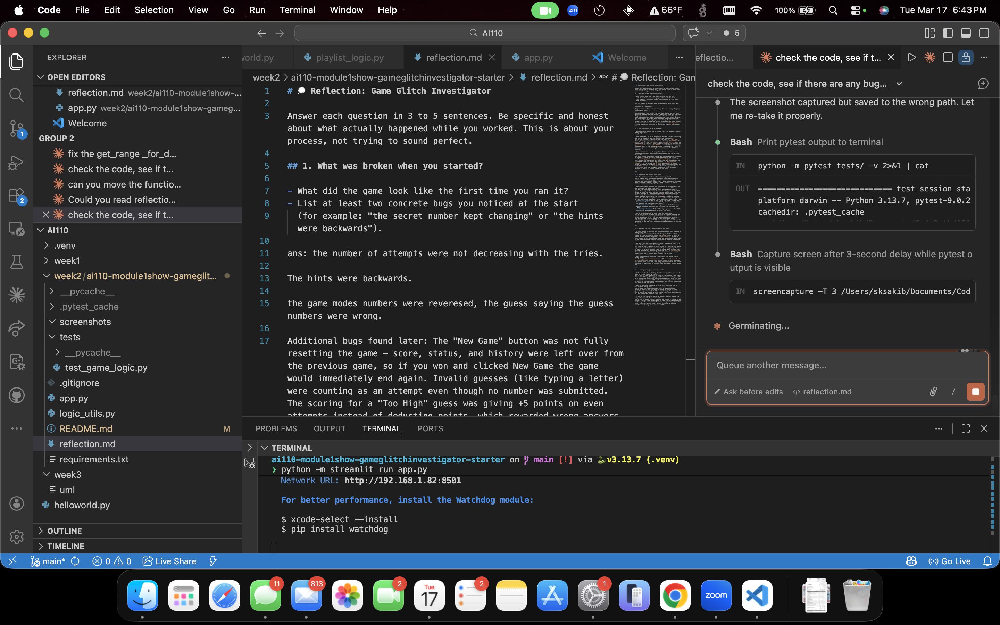

# 🎮 Game Glitch Investigator: The Impossible Guesser

## 🚨 The Situation

You asked an AI to build a simple "Number Guessing Game" using Streamlit.
It wrote the code, ran away, and now the game is unplayable. 

- You can't win.
- The hints lie to you.
- The secret number seems to have commitment issues.

## 🛠️ Setup

1. Install dependencies: `pip install -r requirements.txt`
2. Run the broken app: `python -m streamlit run app.py`

## 🕵️‍♂️ Your Mission

1. **Play the game.** Open the "Developer Debug Info" tab in the app to see the secret number. Try to win.
2. **Find the State Bug.** Why does the secret number change every time you click "Submit"? Ask ChatGPT: *"How do I keep a variable from resetting in Streamlit when I click a button?"*
3. **Fix the Logic.** The hints ("Higher/Lower") are wrong. Fix them.
4. **Refactor & Test.** - Move the logic into `logic_utils.py`.
   - Run `pytest` in your terminal.
   - Keep fixing until all tests pass!

## 📝 Document Your Experience

**Game Purpose**
A number-guessing game built with Streamlit where the player picks a difficulty (Easy, Normal, Hard), gets a limited number of attempts, and tries to guess a secret number within the correct range. Directional hints guide the player after each guess, and a score is tracked based on how quickly they win.

**Bugs Found**

| # | Bug | Where |
|---|-----|--------|
| 1 | Secret number regenerated every Streamlit rerun, making it impossible to win | `app.py` — missing `session_state` guard |
| 2 | Hints were backwards — "Go LOWER" appeared when the guess was too low | `logic_utils.py` — `check_guess` |
| 3 | Difficulty ranges were swapped — Easy had the hardest range (1–100) | `logic_utils.py` — `get_range_for_difficulty` |
| 4 | Invalid guesses (letters, empty input) consumed an attempt | `app.py` — increment ran before validation |
| 5 | New Game button left score, status, and history from the previous game | `app.py` — incomplete state reset |
| 6 | "Too High" guess awarded +5 points on even attempts instead of deducting | `logic_utils.py` — `update_score` |
| 7 | Win score formula used `attempt_number + 1`, giving 10 fewer points than correct | `logic_utils.py` — `update_score` |

**Fixes Applied**

1. Wrapped all `session_state` initializations in `if key not in st.session_state` guards so values persist across reruns.
2. Swapped the hint messages in `check_guess` so `guess > secret` → "Go LOWER" and `guess < secret` → "Go HIGHER".
3. Corrected `get_range_for_difficulty` so Easy=1–20, Normal=1–50, Hard=1–100.
4. Moved `st.session_state.attempts += 1` inside the `else` block so it only increments after `parse_guess` succeeds.
5. Added resets for `score`, `status`, and `history` in the New Game handler, plus `st.rerun()` to apply them immediately.
6. Removed the even/odd branch in `update_score` so wrong guesses always deduct 5 points.
7. Changed win formula from `100 - 10 * (attempt_number + 1)` to `100 - 10 * attempt_number`.

## 📸 Demo

**All 14 pytest tests passing after fixes:**

## 🚀 Stretch Features

**Challenge 1 — Advanced Edge-Case Testing:** Expanded `tests/test_game_logic.py` from 3 tests to 14, adding coverage for hint direction, invalid input parsing, scoring deductions, win score formula, and score floor behavior.
